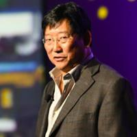

	
 
    

        <a href="https://www.linkedin.com/in/timothychou/">
        
        

          
<strong>Timothy Chou</strong>

            
Stanford University, Lecturer
            

            

        

        </a>
    

    

<h2>Talks and Bios</h2>
<h3>Timothy Chou: AI in Pediatrics: Hype vs. Reality</h3>

<strong>Bio:</strong> Dr. Chou began his career at one of the first Kleiner Perkins startups, Tandem Computers. He’s gone on to be the President of Oracle On Demand, which was the beginning of the company’s multi-billion dollar cloud business. Timothy has also been a member of the board of directors of a public company since 2000. He served on the board of Embarcadero Technologies (NASDAQ: EMBT). In 2007 he joined the board of Blackbaud (NASDAQ: BLKB), which provides application cloud services for social good and in 2017 he joined the board of Teradata (NYSE: TDC). While at Oracle he authored his first landmark book, The End of Software, which foretold the rise of SaaS applications. In a quest to discover the next generation of enterprise software he published the book, Precision – Principles, Practices and Solutions for the Internet of Things. The book is in it’s 3rd printing in Chinese and the prime minister of Vietnam has called it a guidebook for the next step in their economy. In parallel with his commercial career he has also taught at Stanford University for over thirty years. Dr. Chou has been an advisor, mentor and investor in a number of startup companies, some successful and some not so successful. In 2013 he became the Chairman of Alchemist Accelerator, a leading enterprise software accelerator. Today he is executive chairman of Lecida, a provider of enterprise AI applications as well as investing in the fields of AI hardware and edge computing. Since meeting Dr. Chang he’s been working on a project to connect all healthcare machines in all the children’s hospitals in the world, which like the consumer Internet, may completely change children’s healthcare on the planet.

We are actively updating the list. Please stay tuned!

